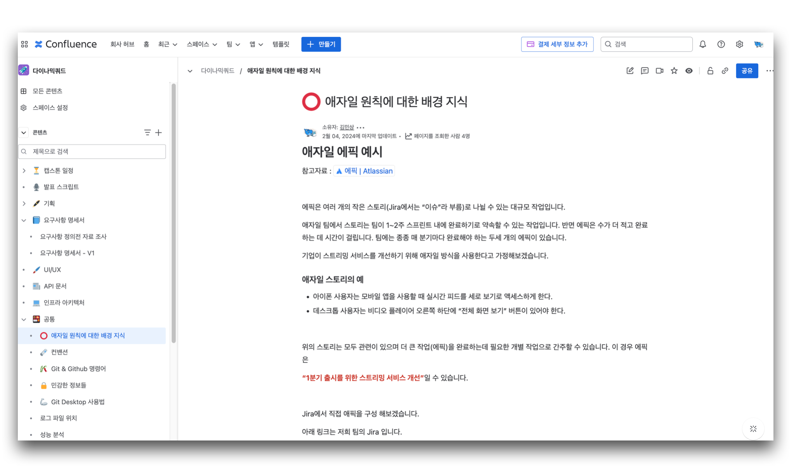
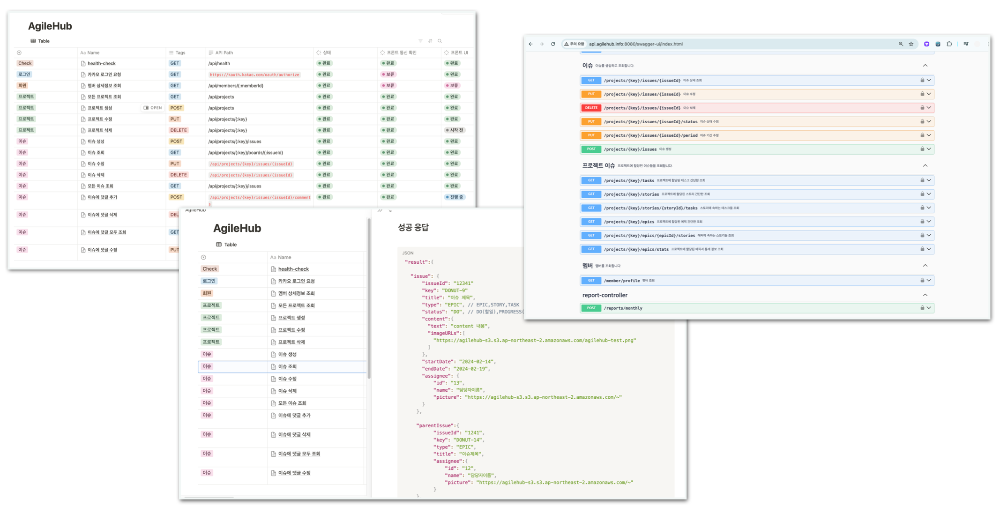

### [AgileHub 바로가기](https://www.agilehub.info)

 

<b> 🚀 애자일 기반 이슈 추적 웹 서비스 🚀 </b>

<b>애자일</b>은 변화에 빠르게 적응하고 반복적으로 개선하는 프로젝트 관리 방법이에요.
 
복잡한 설명 없이도, 우리 서비스로 당신의 프로젝트를 더욱 유연하고 효과적으로 관리해 보세요!
 
 

## 서비스 소개

 

## 🛠️ 기술 스택

### 백엔드

### 인프라

 

## 서비스 요청 흐름도

## CI/CD

## 모니터링 구조도

## 프로젝트 특징

### 1. 이슈 생성 API 구현 및 성능 개선

[[이슈 #1] 커넥션 풀 고갈 문제를 Redis Atomic 연산으로 개선하기](https://babgeuleus.tistory.com/entry/이슈-1-커넥션-풀-데드락을-Redis-Atomic-연산으로-해결하기)

- 프로젝트 목표 및 환경
    - 1000명 규모 조직을 가정하여, 100명의 동시 요청 상황에서 TPS 30~40, 응답시간 2초 이내
    - 에러율 0.1% 이하를 목표로 성능테스트 진행
- 문제 분석 및 원인 파악
    - 테스트 진행 중 20명 동시 요청 시 JPA EntityManager 관련 트랜잭션 오류 발생
    - visualVM 스레드 덤프 분석 결과, handleExisitingTransaction 메소드 호출 시 time Wait 상태 확인
    - 이슈번호 생성 시 REQUIRES_NEW 트랜잭션 분리로 인해, 한 요청당 두 개의 커넥션이 필요해 커넥션 풀이 고갈되는 구조적 문제 발견
- 개선 전략 및 실행 과정
    - 트랜잭션 구조 변경
        - 기존 비관적 락 기반의 REQUIRES_NEW 분리 방식 대신 단일 커넥션 사용 구조로 통합
        - 단, 비관적 락으로 인해 전체 이슈 생성에 락이 걸려 성능이 저하
    - 락 메커니즘 개선
        - 낙관적 락 + 재시도 전략 적용
        - 하지만 동시 요청 많을 때 충돌과 재시도 증가로 성능 악화
    - Redis 도입
        - Redis INCR 명령어의 단일 스레드/원자성 특징으로 락 없이 동시성 해결
        - Write-behind 전략을 도입하여 업데이트된 이슈번호를 30초마다 스케줄러로 DB에 비동기 반영
        - Redis 장애에 대비해 리플리케이션 센티널 구성으로 고가용성 확보
    - 커넥션 풀 최적화
        - HikaricP connection-timeout 5초 설정 (요청 폭주 시 대기 시간 확보)
        - 부하 테스트 결과 기반으로 Connection Pool 200개로 설정
        - MySQL max_connections 500으로 설정 (여유값 확보)
    - 최종적으로 목표했던 100 VUser 환경에서 TPS 33-365, 응답시간 2.9초->0.26초 개선

### 2. 이메일 초대 시스템 성능 및 안정성 개선

[[이슈 #2] 멤버 초대 이메일 발송 설계](https://babgeuleus.tistory.com/entry/%EC%9D%B4%EC%8A%88-2-%EB%A9%A4%EB%B2%84-%EC%B4%88%EB%8C%80-%EC%9D%B4%EB%A9%94%EC%9D%BC-%EB%B0%9C%EC%86%A1-%EC%84%A4%EA%B3%84)

- 초대 토큰 구현 방식 개선
    - 문제: JWT 사용 시 Base64 디코딩으로 payload 노출 위험
    - 해결: UUID v4 기반 랜덤 토큰 방식 채택
    - 성능 검증: SecureRandom 대비 생성 속도 2배 향상, 100만 건 테스트 시 충돌 없음
- 이메일 전송 시스템 개선
    - 초기 문제: Gmail SMTP의 낮은 전송 속도, 높은 스팸 필터링율
    - 해결: AWS SES 도입으로 안정적 전송과 도달률 향상
    - 효과: SPF/DKIM 인증으로 스팸 분류 최소화, 네이버메일 지연 문제 해결
- 초대 코드 저장소 설계
    - Redis 선택 이유
        - TTL 기능으로 10분 유효기간 자동 관리
        - 다중 서버 환경에서 원격 캐시로 활용
        - 메모리 최적화: UUID Base64url 인코딩으로 키-값 크기 256->120바이트 감소
- 이메일 비동기 발송 및 장애 대응 설계
    - CompletableFuture 기반 비동기 처리로 응답시간 578ms > 130ms로 개선
    - 장애 대응
        - Redis 기반 상태 관리로 중복 전송 방지 (PENDING->SENDING->SENT/FAILED)
        - @Retryable로 일시적 장애 시 500ms 간격, 지수 백오프로 재시도
        - ThreadPool 설정 최적화 및 CallerRunsPolicy로 시스템 안정성 확보

### 3. Docker 이미지를 GitHub Actions로 빌드 밎 배포하는 시간 단축 (13분 -> 5분)

[배포 하는데 걸리던 시간 13분을 5분으로 줄이기](https://babgeuleus.tistory.com/entry/%EB%B0%B0%ED%8F%AC-%ED%95%98%EB%8A%94%EB%8D%B0-%EA%B1%B8%EB%A6%AC%EB%8D%98-%EC%8B%9C%EA%B0%84-13%EB%B6%84%EC%9D%84-5%EB%B6%84%EC%9C%BC%EB%A1%9C-%EC%A4%84%EC%9D%B4%EA%B8%B0)

- 멀티스테이지 빌드 사용으로 이미지 크기 감소
- Docker 캐싱을 활용하여 빌드 시간 단축
- Gradle 빌드 옵션 최적화 (병렬 빌드 사용 및 테스트 제외)
- **성과**
    - 처음에 이미지 빌드 시 총 700MB였던 것이 적용 후 320MB로 줄어들어, 50% 이상의 용량 최적화달성
    - 배포 시간 13분에서 5분으로 단축 (약 62% 감소)

### 4. DB 구조 리팩토링: 다중 테이블 상속에서 단일 테이블 전략으로 개선

[[이슈 #3] DB 설계 개선으로 끌어올린 코드 품질과 유지보수성](https://babgeuleus.tistory.com/entry/%EC%9D%B4%EC%8A%88-3-DB-%EC%84%A4%EA%B3%84-%EA%B0%9C%EC%84%A0%EC%9C%BC%EB%A1%9C-%EB%81%8C%EC%96%B4%EC%98%AC%EB%A6%B0-%EC%BD%94%EB%93%9C-%ED%92%88%EC%A7%88%EA%B3%BC-%EC%9C%A0%EC%A7%80%EB%B3%B4%EC%88%98%EC%84%B1)

- 문제사항: 조인 전략을 사용한 이슈 관리 시스템의 복잡성과 성능 저하 문제 해결
- 해결 방안: 단일 테이블 전략으로 테이블 구조 개선 및 코드 최적화
- 마이그레이션 과정
    - 데이터 손실 방지를 위한 점진적 트리클 마이그레이션 전략 구현
    - 새 테이블 설계 및 200만 건 이상의 데이터 안전한 이전
    - 읽기 전용 상태 설정으로 데이터 무결성 보장 및 안전한 마이그레이션
- 성과
    - 마이그레이션 전후 데이터 무결성 검증을 위한 테스트 케이스 구축
    - 코드 복잡성 감소 및 유지보수 용이성 증가
    - 테스트 코드 커버리지 24%에서 42%로 향상

 
 

## 추가정보

### 👉 [팀위키](https://azure-capston.atlassian.net/wiki/x/3IAH)

### 👉 API 문서

### 👉 ERD

### 👉 로그인 요청 흐름도

### 👉 이메일 인증 요청 흐름도

 

### 👉 멤버

|  |  |  |  | 
|:-----------------------------------------------------------------------------------------:|:-----------------------------------------------------------------------------------------:|:------------------------------------------------------------------------------------------:|:-------------------------------------------------------------------------------------------:|
|                         [BE: 김민상](https://github.com/minsang-alt)                         |                            [BE: 최재영](https://github.com/Enble)                            |                            [FE: 신승혜](https://github.com/drimh)                             |                           [FE: 주원희](https://github.com/wonhee126)                           |

